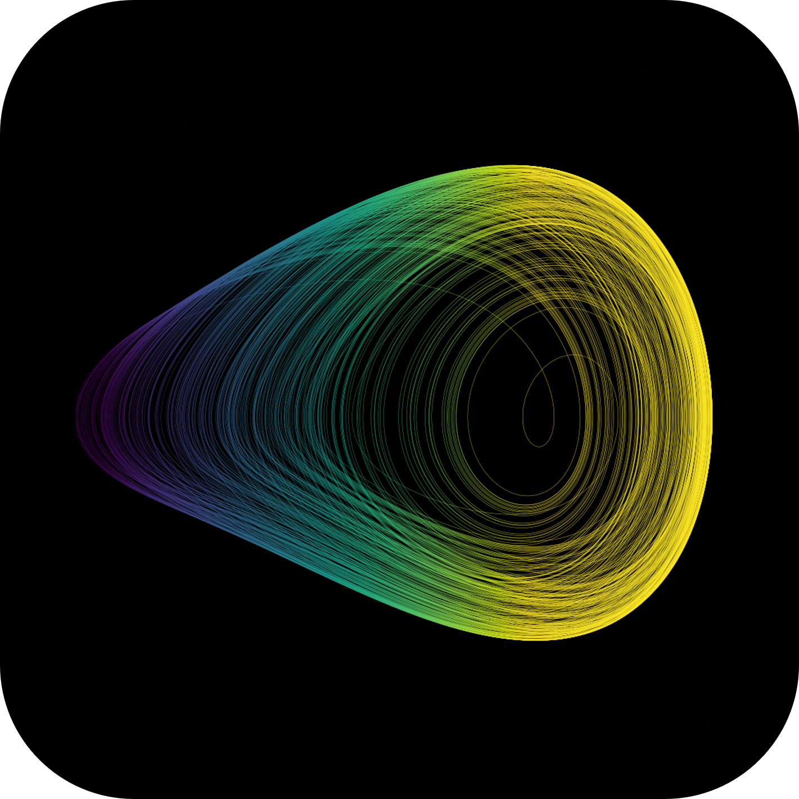

<p align="center">
  
</p>
<h1 align="center">
  CHAOS
</h1>
<p align="center">
  A Nonlinear Dynamics Package for Harmonically Forced Oscillators.
</p> 

## What is the purpose of CHAOS?
**CHAOS** is a user-friendly command line software package designed to facilitate numerical simulations of nonlinear dynamical systems subjected to harmonic forcing. Originally created as a personal productivity tool in my daily life as PhD student, it has since evolved into a collaborative project within our research lab, aimed at standardizing our approach to investigating nonlinear dynamics. Our goal is to provide an open source platform that is accessible and easy to use for anyone interested in exploring the fascinating world of nonlinear dynamics. With **CHAOS**, you can perform advanced simulations and gain valuable insights into complex systems without needing extensive programming expertise.
</p>

## Current Capabilities
Currently, **CHAOS** offers an array of features to be used in pre-programmed dynamical systems:

* Numerical Integration of systems of 1st order ordinary differential equations (ODEs)
* Stroboscopic Poincaré Maps
* Lyapunov Spectra (Method from [Wolf et al. 1985](https://doi.org/10.1016/0167-2789(85)90011-9))
* Bifurcation Diagrams
* 1D and 2D Parameter Diagrams
* Basins of Attraction of Fixed Points
* Basins of Attraction of Dynamical Responses
* Maximum, Minimum and Root Mean Square (RMS) values of state variables
* Custom Calculations inserted by the user (need programming in source code)

## Limitations⚠️
* Need a input file to enter with the simulation and system parameters
* To insert a new dynamical system or perform custom calculations the user needs to modify the source code. An intuitive tutorial will be available soon.
* Currently only 4th order Runge-Kutta method is available as a numerical integrator. More will be added in the future.

## Future Features🎯
* Addition of more numerical integrators
* Test 0-1 for chaos ([doi:10.1137/080718851](https://doi.org/10.1137/080718851))
* Poincaré Map to be compatible with adaptive step-size integrators
* Cloned Dynamics method for the computation of the Lyapunov Spectra ([doi:10.1007/s11071-011-9989-2](https://doi.org/10.1007/s11071-011-9989-2))
* Lyapunov Dimension (Kaplan-Yorke Dimension) and Kolmogorov-Sinai Entropy
* New module to handle general dynamical systems with all the features available
* Better input files
* Better Menu

## Citing CHAOS

We kindly ask users to cite the following reference in any publications reporting work done with **CHAOS**:

- *L. G. Costa, CHAOS - A Nonlinear Dynamics Package for Harmonically Forced Oscillators, 2023, https://github.com/lguedesc/CHAOS*

Bibtex entry:
```
@misc{CHAOSpackage,
  author       = {L. G. Costa},
  title        = {{CHAOS} - A Nonlinear Dynamics Package for Harmonically Forced Oscillators},
  year         = {2023},
  howpublished = "\url{https://github.com/lguedesc/CHAOS}"
}
```

## License
**CHAOS** is released under the GNU General Public License v3.0 (GNU GPL) license. See the LICENSE file for details. All new contributions must be made under the GNU GPL v3.0 license.

## Disclaimer
The Software and code samples available on this repository are provided "as is" without warranty of any kind, either express or implied. Use at your own risk.

## Funding
- [CNPq - Conselho Nacional de Desenvolvimento Científico e Tecnológico](https://www.gov.br/cnpq/pt-br)
- [FAPERJ - Fundação Carlos Chagas Filho de Amparo à Pesquisa do Estado do Rio de Janeiro](https://www.faperj.br/)
